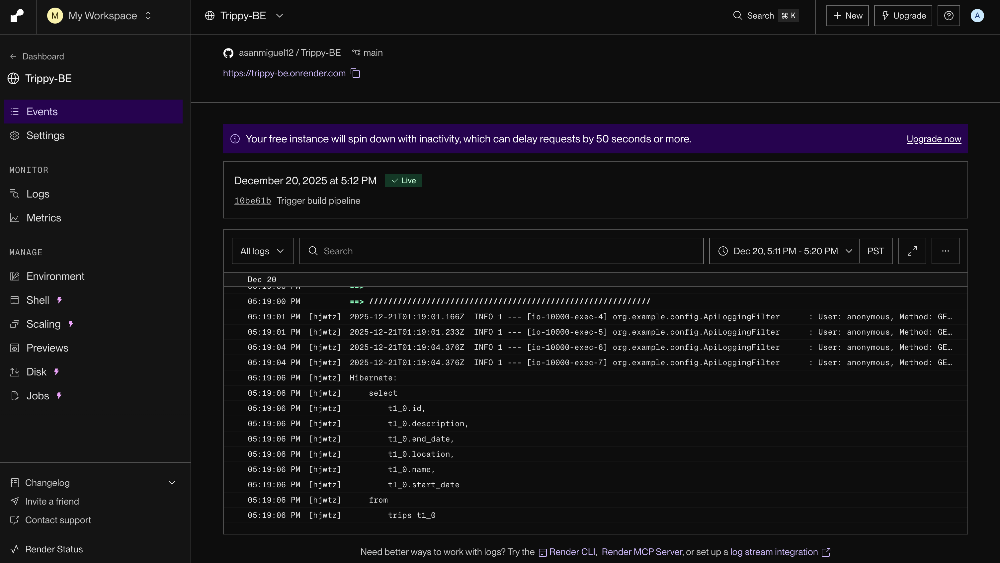

# Trippy-BE
Backend for Trippy Itinerary Planner# 📦 Project Name
A backend Java application built with clean architecture, RESTful API design, and Supabase‑powered data persistence.

---

## 🚀 Overview
This project provides a lightweight backend service built in Java, exposing REST endpoints for core application features.  
Supabase is used as the PostgreSQL database and authentication provider, while Render hosts the deployed API.

---

## 🛠️ Tech Stack
- Java 17+
- Spring Boot (or your chosen framework)
- Supabase (PostgreSQL + Auth)
- Render (Deployment)
- Maven or Gradle
- JSON-based REST APIs

---

## 🧩 Features
- RESTful API endpoints  
- Supabase-backed database operations  
- Authentication & authorization (optional)  
- Error handling & validation  
- Environment-based configuration  
- Deployed API accessible via Render  

---

## 🌐 Deployment (Render)
The backend is deployed on Render for continuous hosting and automatic redeploys on push.

## 🗄️ Database (Supabase)
Supabase is used for:
- PostgreSQL data storage  
- Row-level security (optional)  
- Auth (optional)  
- Real-time updates (optional)

### Supabase Database

---
